<!-- Reference: @Li2017 -->

In this vignette, we will analyze a spatial transcriptomics dataset (10x Visium) comprising three slides from murine lymph nodes, two of which obtained after a 48-hour infection with _Mycobacterium smegmatis_ (@Lopez2022). As a reference, we will use the paired single-cell RNA-seq (10x Chromium) data from the same study. The raw data is publicly available on GEO ([GSE173778](https://www.ncbi.nlm.nih.gov/geo/query/acc.cgi?acc=GSE173778)), but for ease of use, we have made it available through the `SpatialDDLSdata` R data package.

# Loading data

Firstly, let's load the required packages and data:


```r
library("SpatialDDLS")
library("SingleCellExperiment")
library("SpatialExperiment")
library("ggplot2")
library("ggpubr")

## in case it is not installed
if (!requireNamespace("SpatialDDLS", quietly = TRUE)) {
  if (!requireNamespace("devtools", quietly = TRUE)) {
    install.packages("devtools")
  }
  devtools::install_github("diegommcc/SpatialDDLSdata")
}
library("SpatialDDLSdata")
# SingleCellExperiment with scRNA-seq
data(MouseDLN.SCE) 
# SpatialExperiment with spatial transcriptomics data
data(MouseDLN.ST)
```

For instance, let's plot the slides contained in the object ny condition:


```r
cbind(spatialCoords(MouseDLN.ST), colData(MouseDLN.ST)) %>% as.data.frame() %>% 
  ggplot(aes(X0, X1, color = lymph_node)) + 
  geom_point() + ggtitle("Mouse lymph nodes by condition") + 
  theme_classic() + coord_fixed()
```

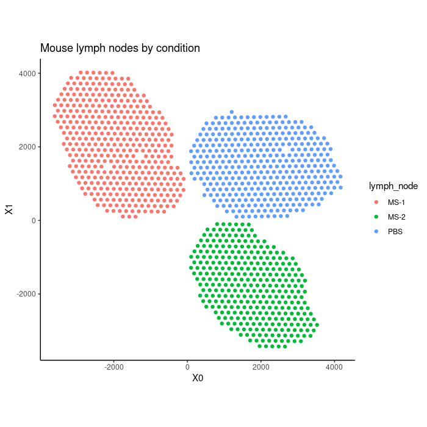

With regards to the single-cell RNA-seq data, preprocessing and visualization using non-linear dimensionality reduction algorithms could be performed, but such analysis is outside the scope of this tutorial.


## Loading data into a `SpatialDDLS` object

Now, we need to create a `SpatialDDLS` object, which will serve as the central core for all subsequent steps. We suggest including both the spatial and single-cell transcriptomics data to enable filtering and selection of only those genes that are present in both data types for further analysis. Furthermore, we recommend filtering genes based on their expression levels. Please refer to the documentation to review the implemented strategies (`sc.filt.genes.cells` and `sc.filt.genes.cluster` parameters). 


```r
mouseDLN.SDDLS <- createSpatialDDLSobject(
  sc.data = MouseDLN.SCE, 
  sc.cell.ID.column = "CellID", 
  sc.gene.ID.column = "GeneSymbol",
  sc.cell.type.column = "broad_cell_types",
  st.data = MouseDLN.ST,
  sc.filt.genes.cells = TRUE,
  sc.min.counts = 1, 
  sc.min.cells = 3,
  sc.filt.genes.cluster = TRUE,
  sc.min.mean.counts = 3,
  st.spot.ID.column = "CellID",
  st.gene.ID.column = "GeneSymbol"
)
```

```
## === 1 SpatialExperiment objects provided
```

```
##    === Processing spatial transcriptomics data
```

```
##       - Filtering features:
```

```
##          - Selected features: 13948
```

```
##          - Discarded features: 0
```

```
## 
```

```
## === Processing single-cell data
```

```
##       - Removing 16 genes without expression in any cell
```

```
##       - Filtering features:
```

```
##          - Selected features: 1142
```

```
##          - Discarded features: 11696
```

```
## 
## === Number of shared genes between single-cell and spatial transcriptomics datasets: 1140
```

```
##     - Original number of genes of single-cell data: 1142
```

```
##     - Original number of genes of spatial transcriptomics data (object with more genes): 13948
```

We can show basic information about the object: 


```r
mouseDLN.SDDLS
```

```
## An object of class SpatialDDLS 
## Real single-cell profiles:
##   1140 features and 14989 cells
##   rownames: Vrk1 Limd2 Sell ... Sell Atp6v1g1 mt-Atp6 Cct8 
##   colnames: GTAACACAGATGTTAG-1-2 CATTGTTGTTCGGACC-1-3 ACTTAGGTCGCATTGA-1-0 ... ACTTAGGTCGCATTGA-1-0 CACGGGTTCGCTTGCT-1-2 TGGATCATCATTTGTC-1-2 CTCCGATTCAACCCGG-1-0 
## Spatial experiments:
##   1 experiments
##   1140 features and 1092 cells
##   rownames: Gsn Psmb9 Mapre1 ... Mapre1 Rpl39 C1qbp Ikzf2 
##   colnames: TCCGTTTAGCCTTGAA-1-1 GGGTCATGCGTACCAT-1-0 GATCGGCGATAAGTCG-1-0 ... GATCGGCGATAAGTCG-1-0 TACGTGCACTATGCTG-1-0 TACATAGGCATACACC-1-1 TTCCAATCAGAGCTAG-1-1 
## Project: SpatialDDLS-Proj
```

In this case, we are only working with 1 spatial transcriptomics dataset, but an arbitrary number of `SpatialExperiment` objects can be provided. 

## Simulation of mixed transcriptional profiles

Now, we are going to simulate the cell composition matrices that will serve to simulate mixed transcriptional profiles with known cell proportions. This is done by the `genMixedCellProp` function in which we can control different aspects such as the number of mixed transcriptional profiles that will be generated, the number of cells used for each mixed profile, etc. These parameters must be decided depending on the reference and the available computational resources. For this example, and as standard reference, we will use `num.sim.spots = 15000` and `n.cells = 200`. For more information about these parameters, see the documentation. These cell type proportions will be generated by three methods: 

* A random sampling of a Dirichlet distribution. Moreover, in order to make these proportions more sparse, the `prob.sparity` parameter controls the probability of having missing cell types in each simulated spot, as opposed to a mixture of all cell types. 
* Pure mixed transcriptional profiles composed of `n.cells` cells of the same cell type aggregated.
* Transcriptional profiles in which a minimum number of missing cell types will be imposed. This is control by the `min.zero.prop` argument. 

The relative abundance of samples generated by these criteria can be control by the `proportion.method` parameter. Finally,`genMixedCellProp` will automatically divide the reference cells contained in the `single.cell.real` slot into training and test subsets, and randomly assign `n.cells` cells to form every mixed transcriptional profile. 


```r
mouseDLN.SDDLS <- genMixedCellProp(
  mouseDLN.SDDLS,
  cell.ID.column = "CellID",
  cell.type.column = "broad_cell_types",
  num.sim.spots = 15000,
  n.cells = 200,
  train.freq.cells = 2/3,
  train.freq.spots = 2/3,
  proportion.method = c(0.4, 0.3, 0.3),
  prob.sparity = 0.5, 
  min.zero.prop = 9,
  balanced.type.cells = TRUE,
  verbose = TRUE
)
```

```
## 
## === The number of mixed profiles that will be generated is equal to 15000
```

```
## 
## === Training set cells by type:
```

```
##     - B cells: 5573
##     - CD4 T cells: 1362
##     - CD8 T cells: 2179
##     - cDC1s: 67
##     - cDC2s: 58
##     - GD T cells: 59
##     - Macrophages: 70
##     - Migratory DCs: 199
##     - Monocytes: 53
##     - NK cells: 62
##     - pDCs: 52
##     - Tregs: 260
```

```
## === Test set cells by type:
```

```
##     - B cells: 2786
##     - CD4 T cells: 681
##     - CD8 T cells: 1089
##     - cDC1s: 33
##     - cDC2s: 29
##     - GD T cells: 29
##     - Macrophages: 35
##     - Migratory DCs: 100
##     - Monocytes: 26
##     - NK cells: 31
##     - pDCs: 26
##     - Tregs: 130
```

```
## === Probability matrix for training data:
```

```
##     - Mixed spots: 10000
##     - Cell types: 12
```

```
## === Probability matrix for test data:
```

```
##     - Mixed spots: 5000
##     - Cell types: 12
```

```
## DONE
```


Then, we can call the `simMixedProfiles` function which will generate the actual mixed transcriptional profiles using the cell composition matrices generated in the previous step. This step may take a while depending on the number of transcriptional profiles to be simulated, so be patient! In addition, the way the mixed profiles will be generated can be decided. We recommend summing up raw counts, and then normalize samples by log-CPM (`mixing.function = "AddRawCount"`), but other methods are available (see Documentation). 


```r
mouseDLN.SDDLS <- simMixedProfiles(mouseDLN.SDDLS, threads = 3)
```

```
## === Setting parallel environment to 3 thread(s)
```

```
## 
## === Generating train bulk samples:
```

```
## 
## === Generating test bulk samples:
```

```
## 
## DONE
```

## Training a fully-connected neural network using mixed transcriptional profiles

Having generated a set of mixed transcriptional profiles with known cell composition, we can then train a neural network using the training subset to predict cell type proportions in the test subset. Once trained, the model can make cell type proportion predictions based on the transcriptional profile of new samples, such as each spot in a spatial transcriptomics experiment. The architecture of the network is fully customizable and should be adjusted according to the number of genes used as input and the complexity of the biological context being studied. For this study, we will employ a model with three hidden layers, each consisting of 200 neurons, and a training process involving 40 epochs.


```r
mouseDLN.SDDLS <- trainDeconvModel(
  mouseDLN.SDDLS,
  num.epochs = 40,
  num.hidden.layers = 3, 
  num.units = c(200, 200, 200)
) 
```

```
## Loaded Tensorflow version 2.5.3
```

```
## === Training and test from stored data
```

```
##     Using only simulated mixed samples
## 
##     Using only simulated mixed samples
```

```
## Model: "SpatialDDLS"
## ________________________________________________________________________________________________________________________________________________________________________________________________________________________________________________________________________________
## Layer (type)                                                                                                              Output Shape                                                                                                 Param #                                  
## ================================================================================================================================================================================================================================================================================
## Dense1 (Dense)                                                                                                            (None, 200)                                                                                                  228200                                   
## ________________________________________________________________________________________________________________________________________________________________________________________________________________________________________________________________________________
## Activation1 (Activation)                                                                                                  (None, 200)                                                                                                  0                                        
## ________________________________________________________________________________________________________________________________________________________________________________________________________________________________________________________________________________
## Dropout1 (Dropout)                                                                                                        (None, 200)                                                                                                  0                                        
## ________________________________________________________________________________________________________________________________________________________________________________________________________________________________________________________________________________
## Dense2 (Dense)                                                                                                            (None, 200)                                                                                                  40200                                    
## ________________________________________________________________________________________________________________________________________________________________________________________________________________________________________________________________________________
## Activation2 (Activation)                                                                                                  (None, 200)                                                                                                  0                                        
## ________________________________________________________________________________________________________________________________________________________________________________________________________________________________________________________________________________
## Dropout2 (Dropout)                                                                                                        (None, 200)                                                                                                  0                                        
## ________________________________________________________________________________________________________________________________________________________________________________________________________________________________________________________________________________
## Dense3 (Dense)                                                                                                            (None, 200)                                                                                                  40200                                    
## ________________________________________________________________________________________________________________________________________________________________________________________________________________________________________________________________________________
## Activation3 (Activation)                                                                                                  (None, 200)                                                                                                  0                                        
## ________________________________________________________________________________________________________________________________________________________________________________________________________________________________________________________________________________
## Dropout3 (Dropout)                                                                                                        (None, 200)                                                                                                  0                                        
## ________________________________________________________________________________________________________________________________________________________________________________________________________________________________________________________________________________
## Dense4 (Dense)                                                                                                            (None, 12)                                                                                                   2412                                     
## ________________________________________________________________________________________________________________________________________________________________________________________________________________________________________________________________________________
## ActivationSoftmax (Activation)                                                                                            (None, 12)                                                                                                   0                                        
## ================================================================================================================================================================================================================================================================================
## Total params: 311,012
## Trainable params: 311,012
## Non-trainable params: 0
## ________________________________________________________________________________________________________________________________________________________________________________________________________________________________________________________________________________
```

```
## 
## === Training DNN with 10000 samples:
```

```
## 
## === Evaluating DNN in test data (5000 samples)
```

```
##    - loss: 0.0617
##    - accuracy: 0.8562
##    - mean_absolute_error: 0.0143
##    - categorical_accuracy: 0.8562
```

```
## 
## === Generating prediction results using test data
```

```
## DONE
```

By default, some metrics about the performance of the model will be displayed. More advanced metrics can be calculated using the `calculateEvalMetrics` function. This function computes mean absolute error (MAE) and mean squared error (MSE) metrics per cell type, which can provide insight into the model's performance for each cell type. These metrics can be visualized using various functions:


```r
mouseDLN.SDDLS <- calculateEvalMetrics(mouseDLN.SDDLS)
distErrorPlot(
  mouseDLN.SDDLS,
  error = "AbsErr",
  x.by = "CellType",
  color.by = "CellType", 
  error.labels = FALSE, 
  type = "boxplot",
  size.point = 0.5
)
```

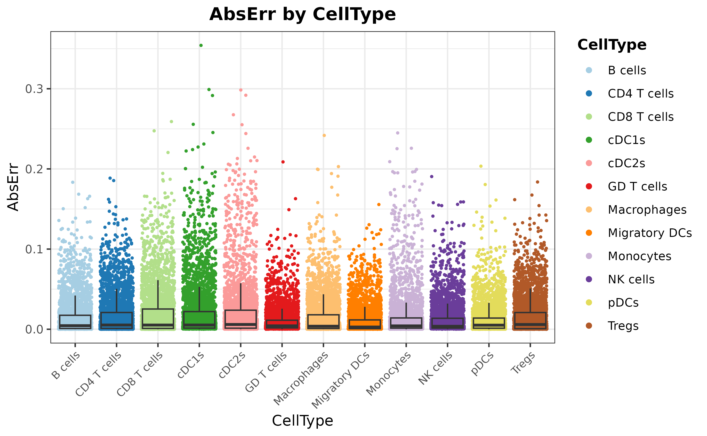


```r
barErrorPlot(mouseDLN.SDDLS, error = "MAE", by = "CellType")
```

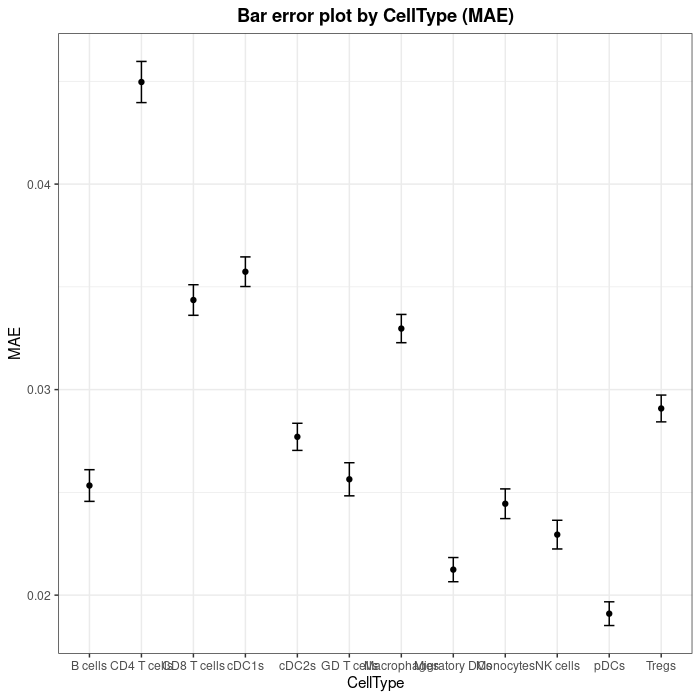


```r
distErrorPlot(
  mouseDLN.SDDLS,
  x.by = "pBin",
  error = "AbsErr",
  facet.by = "CellType",
  color.by = "CellType", 
  error.label = TRUE,
  type = "boxplot"
)
```


```r
corrExpPredPlot(
  mouseDLN.SDDLS,
  color.by = "CellType",
  facet.by = "CellType",
  corr = "both", 
  size.point = 0.5
)
```

```
## `geom_smooth()` using formula = 'y ~ x'
```

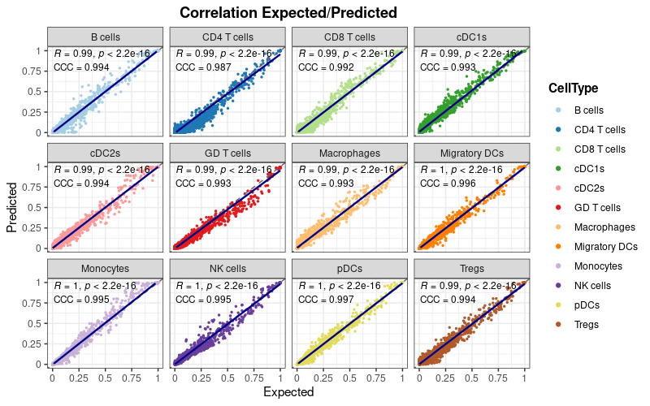

As demonstrated, the overall performance is satisfactory, indicating that the model is capable of comprehending the distinctive features of each cell type to provide precise predictions regarding the cell type composition of the samples.

## Deconvolution of the spatial transcriptomics dataset

Finally, we can use our trained model to deconvolute the signals of each spot! This step is very quick. As we already loaded the spatial transcriptomics experiment we wish to deconvolute, calling the `deconvSpatialDDLS` function is sufficient. However, if additional spatial experiments are to be included, see `loadSTProfiles`. 


```r
mouseDLN.SDDLS <- deconvSpatialDDLS(mouseDLN.SDDLS)
```

```
##    No 'index.st' provided. Deconvoluting all SpatialExperiment objects contained in the `spatial.experiments` slot
```

```
## === Setting 0 features that are not present in trained model to zero
```

```
## === Normalizing and scaling data
```

```
## === Predicting cell type proportions
```

```
## DONE
```

Now, let's project these predicted proportions in the spatial coordinates:


```r
plotSpatialPropAll(mouseDLN.SDDLS, index.st = 1)
```

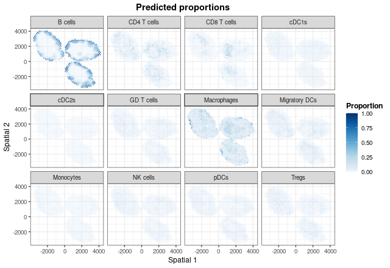

To reveal hidden patterns in the coordinates caused by using the same color scale, we can utilize the `plotSpatialProp` function to plot each cell type independently:


```r
for (i in mouseDLN.SDDLS@trained.model@cell.types) {
  print(plotSpatialProp(
    mouseDLN.SDDLS, index.st = 1, cell.type = i, colors = "spectral") + coord_fixed()
  )
}
```

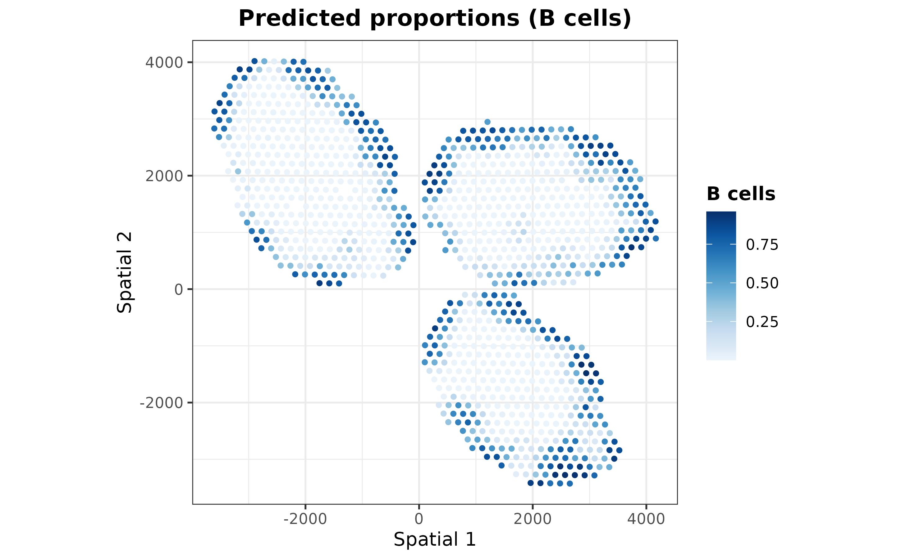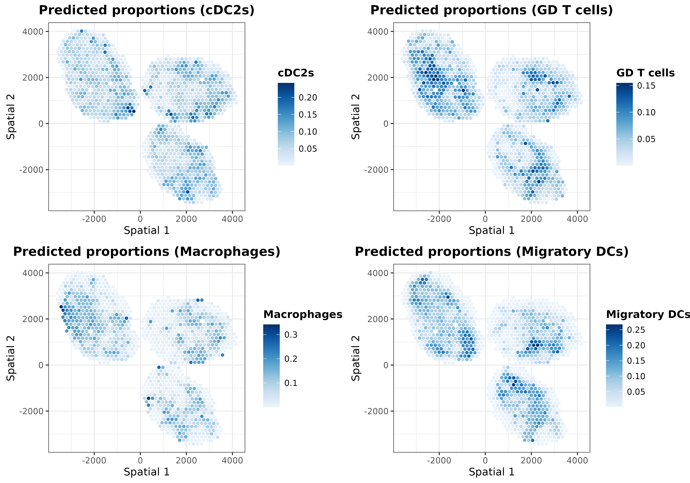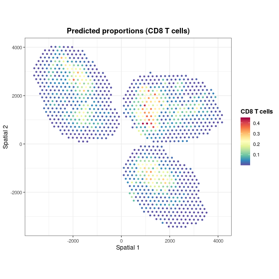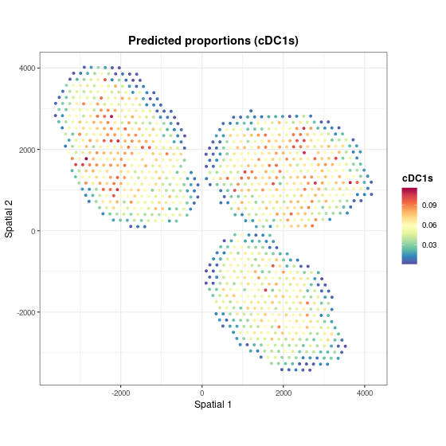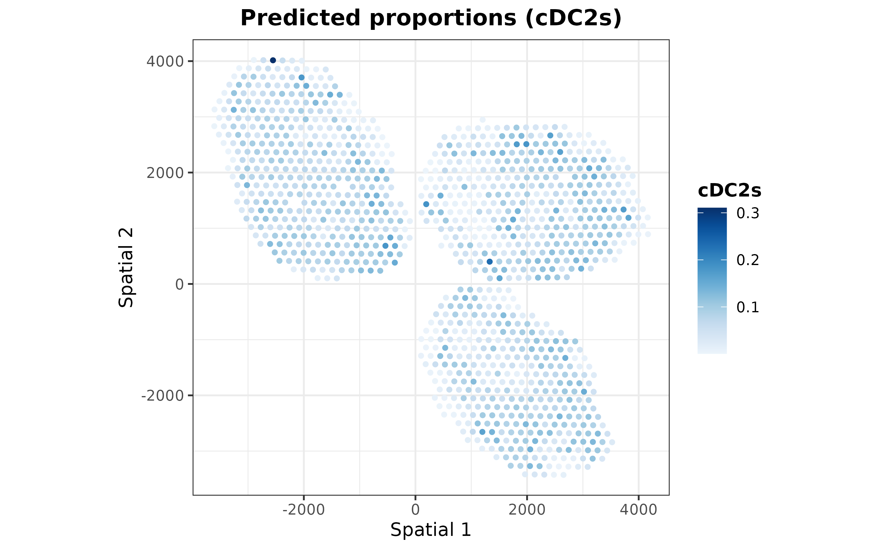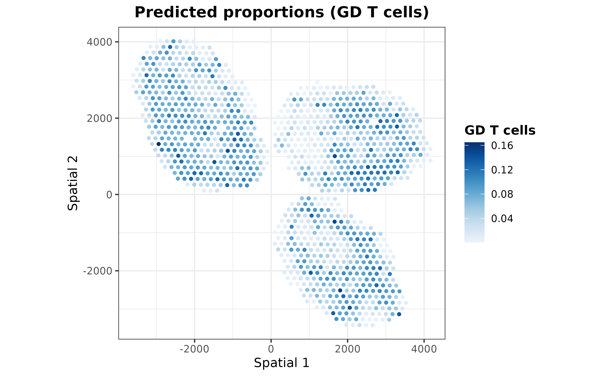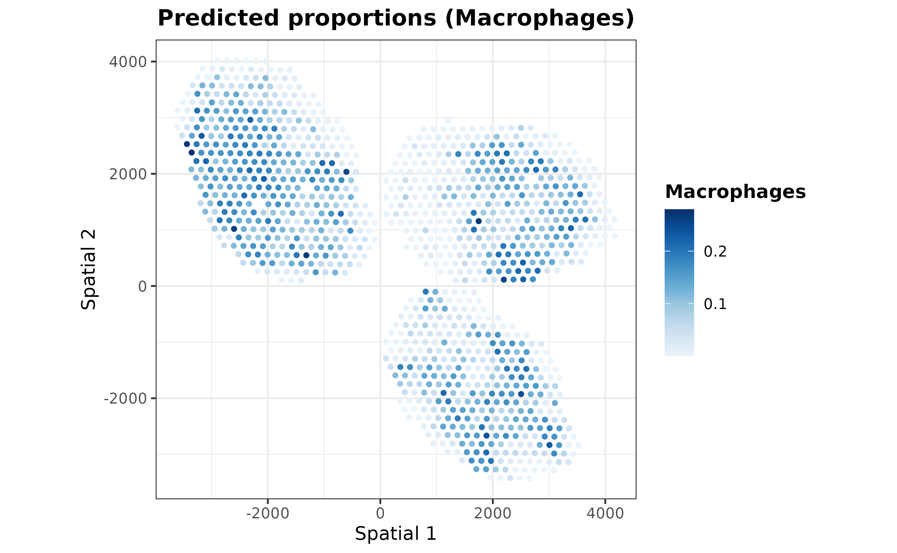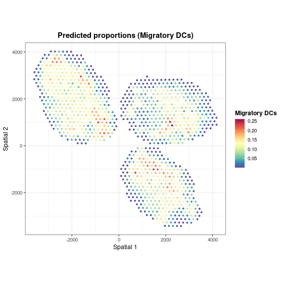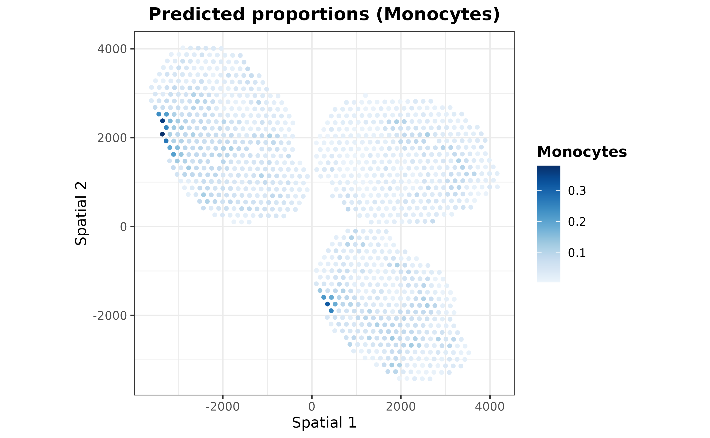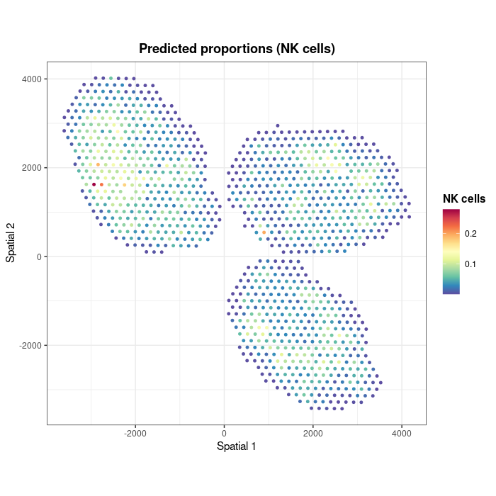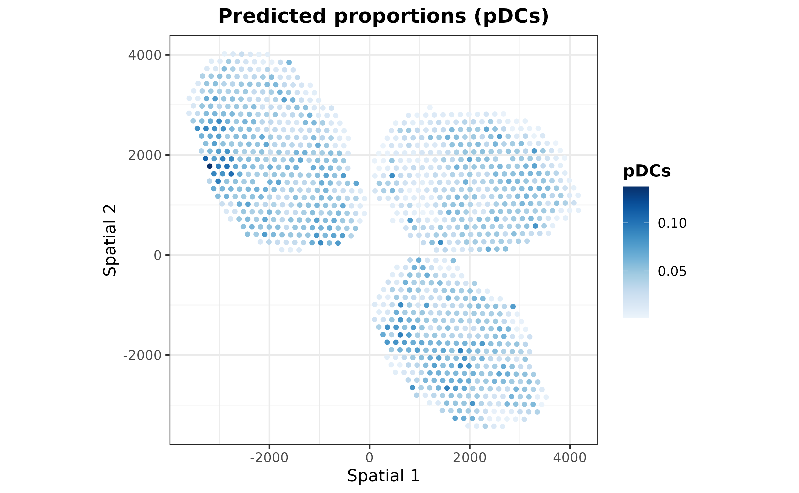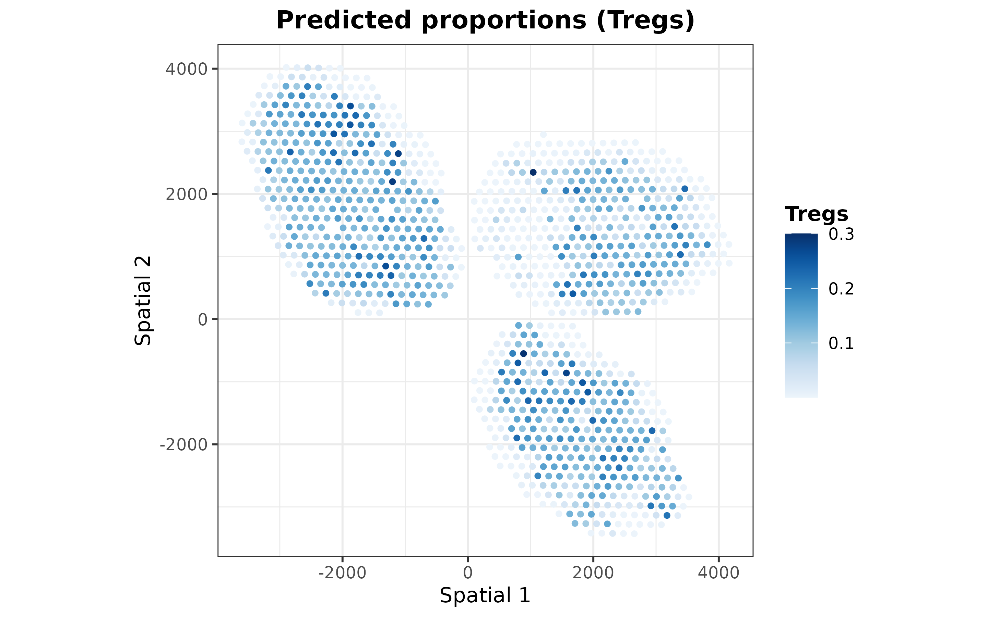

## Comparing results with general cell markers

Finally, we can check whether there is a collocation between the predicted cell type proportions and the expression of some classic markers for each cell type. 


```r
customMarkers <- list(
  "B cells" = c("Cd74", "Cd19", "Cd79a", "Cd79b", "Ly6d"),
  "CD4 T cells" = c("Cd4", "Lef1", "Fyb"),
  "CD8 T cells" = c("Cd8b1", "Cd8a", "Trac"),
  cDC1s = c("Xcr1", "Irf8"),
  cDC2s = c("Irf4", "Cd4"),
  "GD T cells" = c("Il7r", "Id2"),
  Macrophages = c("Lyz2", "Lyz1", "Cd86", "Ly6c1"),
  "Migratory DCs" = c("Ccl5", "Anxa3", "Fscn1"),
  Monocytes = c("Fcer1g", "Cst3", "Lst1", "Itgam", "Kit", "Fcgr3"),
  "NK cells" = c("Nkg7", "Il2rb", "Gzma"),
  pDCs = c("Siglech", "Plac8", "Ly6c2", "Vtsb", "Zeb2", "Siglech"),
  Tregs = c("Ikzf2", "Il2ra", "Foxp3")
) %>% lapply(FUN = function(x) x[x %in% rownames(MouseDLN.ST)])
```


```r
## calculate z-scores
exprST <- MouseDLN.ST@assays@data[[1]]
logCPM <- edgeR::cpm(exprST, log = TRUE)
meanZscoresCustom <- purrr::map(
  .x = names(customMarkers), 
  .f = ~{ colMeans(t(scale(t(logCPM[customMarkers[[.x]], , drop = FALSE])))) }
) %>% do.call(cbind, .) 
colnames(meanZscoresCustom) <- names(customMarkers)
```


```r
color.z.scores <- rev(colorRampPalette(RColorBrewer::brewer.pal(n = 10, name = "RdBu"))(20))
st.coor <- SpatialExperiment::spatialCoords(
  spatial.experiments(object = mouseDLN.SDDLS, index.st = 1)
)
colnames(st.coor) <- paste("Spatial", 1:2)
dfPlotLong <- reshape2::melt(
  as.data.frame(cbind(st.coor, meanZscoresCustom)), 
  id.vars = c("Spatial 1", "Spatial 2"), 
  variable.name = "CellType", value.name = "Zscore"
)
dfPlotLong %>% ggplot(
  aes(x = .data[["Spatial 1"]], y = .data[["Spatial 2"]], color = Zscore)
) + geom_point(size = 0.5) + theme_classic()  + 
  ggtitle("Mean z-score of cell type markers") + 
  scale_color_gradientn(colors = color.z.scores, limit = c(-2, 2)) + 
  theme(
    plot.title = element_text(face = "bold", hjust = 0.5),
    axis.title.x = element_blank(), axis.text.x = element_blank(),
    axis.ticks.x = element_blank(), axis.title.y = element_blank(),
    axis.text.y = element_blank(), axis.ticks.y = element_blank()
  ) + coord_fixed() + facet_wrap(~ CellType)
```


## References
