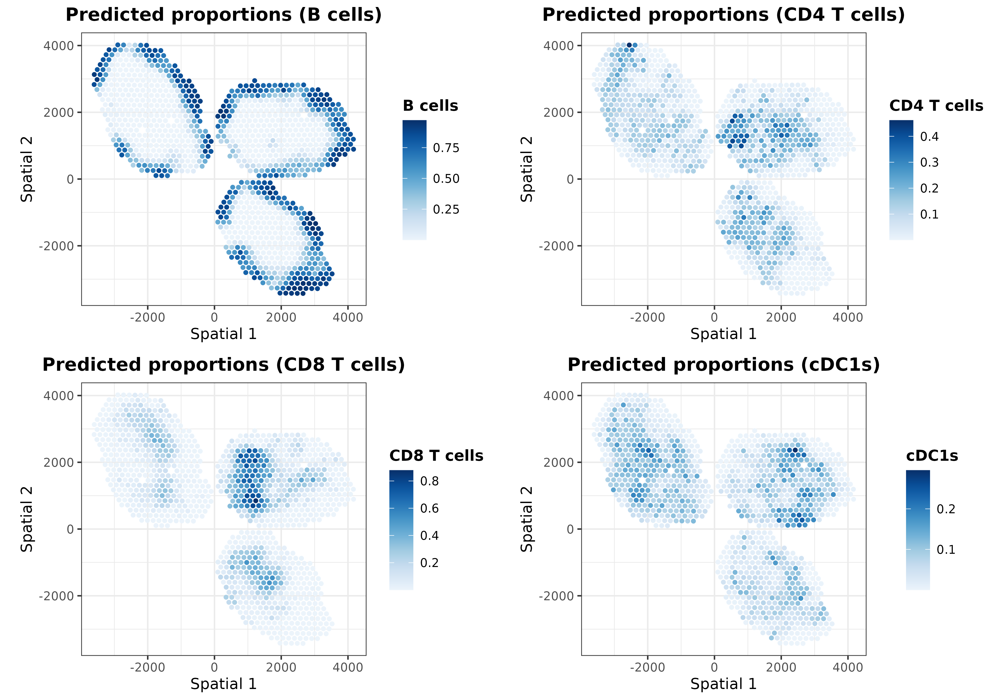
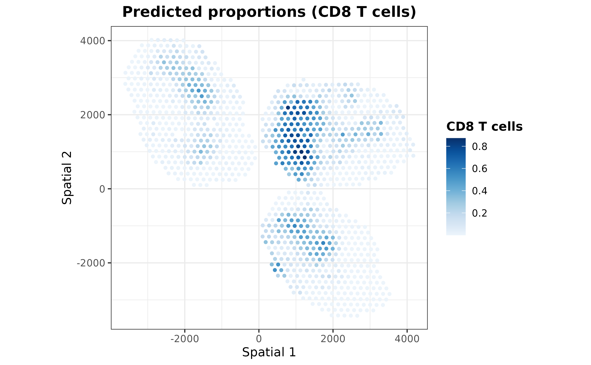
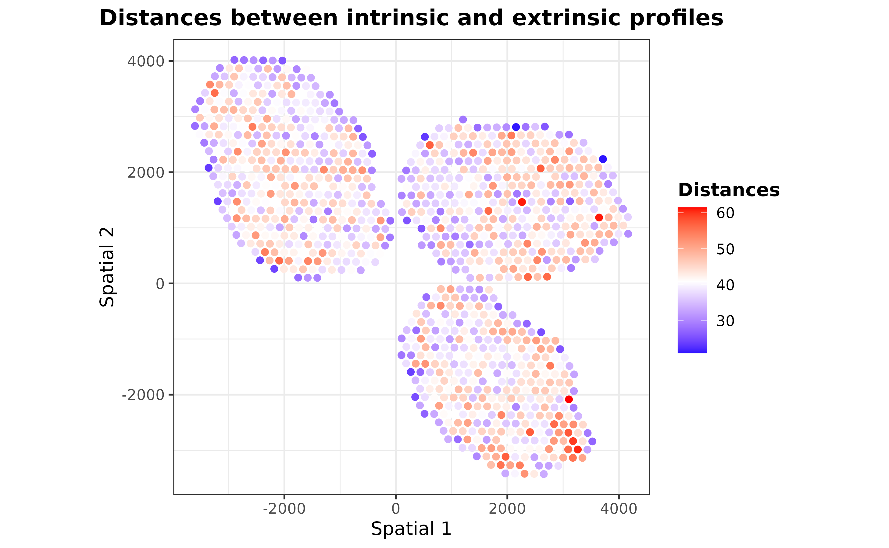
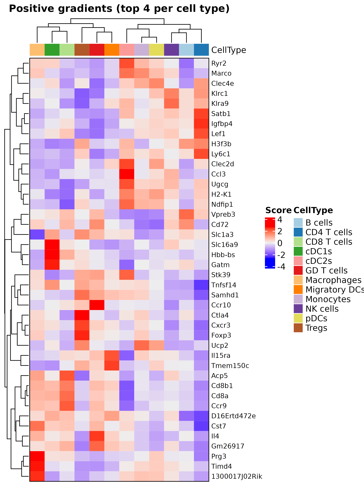
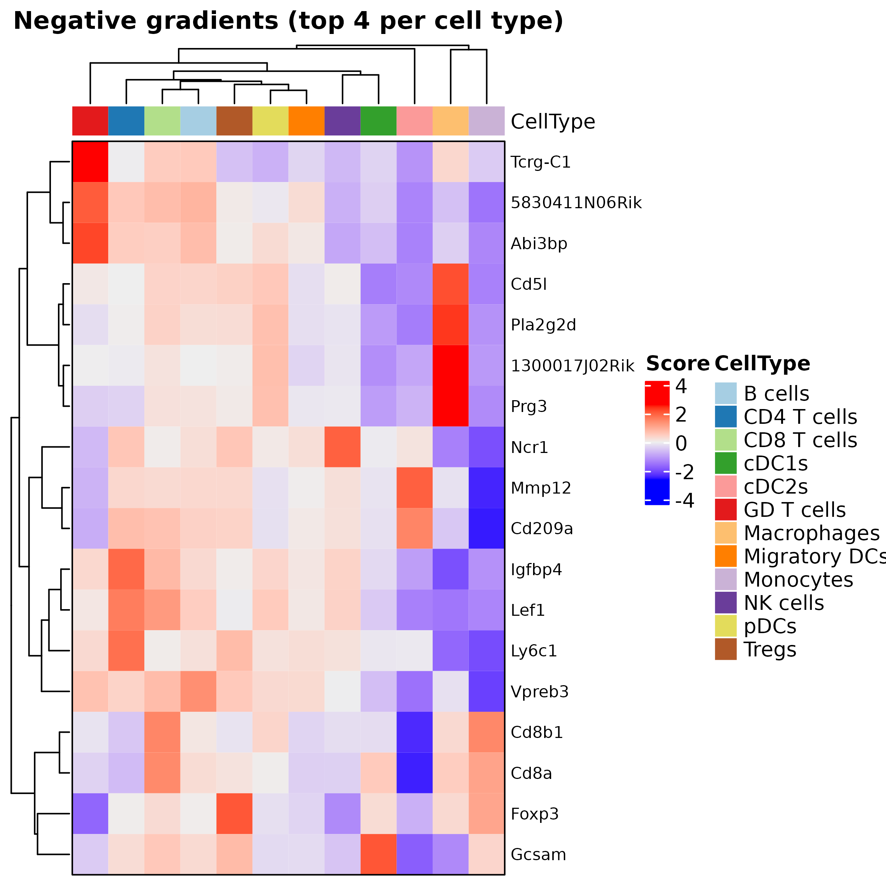
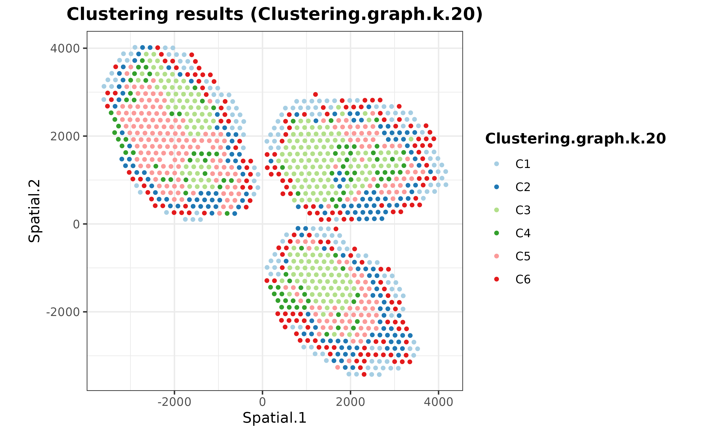

In this vignette, we will analyze a spatial transcriptomics dataset (10x Visium) comprising three slides from murine lymph nodes, two of which obtained after a 48-hour infection with _Mycobacterium smegmatis_ (@Lopez2022). As a reference, we will use the paired single-cell RNA-seq (10x Chromium) data from the same study. The raw data is publicly available on GEO ([GSE173778](https://www.ncbi.nlm.nih.gov/geo/query/acc.cgi?acc=GSE173778)), but for ease of use, we have made it available through the `SpatialDDLSdata` R data package.

# Loading data

Firstly, let's load the required packages and data:


```r
library("SpatialDDLS")
library("SingleCellExperiment")
library("SpatialExperiment")
library("ggplot2")
library("ggpubr")

## in case it is not installed
if (!requireNamespace("SpatialDDLSdata", quietly = TRUE)) {
  if (!requireNamespace("devtools", quietly = TRUE)) {
    install.packages("devtools")
  }
  devtools::install_github("diegommcc/SpatialDDLSdata")
}
library("SpatialDDLSdata")
# SingleCellExperiment with scRNA-seq
data(MouseDLN.SCE) 
# SpatialExperiment with spatial transcriptomics data
data(MouseDLN.ST)
```

Let's explore the spatial transcriptomics data contained in the `MouseDLN.ST` object: 


```r
cbind(spatialCoords(MouseDLN.ST), colData(MouseDLN.ST)) %>% as.data.frame() %>% 
  ggplot(aes(X0, X1, color = lymph_node)) + 
  geom_point() + ggtitle("Mouse lymph nodes by condition") + 
  theme_classic() + coord_fixed()
```

<div class="figure" style="text-align: center">

<p class="caption">plot of chunk spatialdata-cond</p>
</div>

With regard to the single-cell RNA-seq data, preprocessing and visualization could be performed, but such analysis is outside the scope of this tutorial.


## Loading data into a `SpatialDDLS` object

Now, we need to create a `SpatialDDLS` object, which will serve as the central core for all subsequent steps. We suggest including both the spatial and single-cell transcriptomics data to enable filtering and selection of only those genes that are present in both data types for further analyses. Additionally, we recommend filtering genes based on their expression levels in order to reduce the number of dimensions and consider only meaningful genes. Please refer to the documentation to review the implemented strategies (specially `sc.n.genes.per.cluster` and `sc.min.mean.counts` parameters). 


```r
mouseDLN.SDDLS <- createSpatialDDLSobject(
  sc.data = MouseDLN.SCE, 
  sc.cell.ID.column = "CellID", 
  sc.gene.ID.column = "GeneSymbol",
  sc.cell.type.column = "broad_cell_types",
  st.data = MouseDLN.ST,
  sc.min.counts = 1, 
  sc.min.cells = 1,
  sc.filt.genes.cluster = TRUE, 
  sc.n.genes.per.cluster = 150,
  sc.min.mean.counts = 2,
  st.spot.ID.column = "CellID",
  st.gene.ID.column = "GeneSymbol"
)
```

```
## === 1 SpatialExperiment objects provided
```

```
##    === Processing spatial transcriptomics data
```

```
##       - Filtering features:
```

```
##          - Selected features: 12514
```

```
##          - Discarded features: 1434
```

```
## 
```

```
## === Processing single-cell data
```

```
##       - Removing 16 genes without expression in any cell
```

```
##       - Filtering features:
```

```
##          - Selected features: 12350
```

```
##          - Discarded features: 488
```

```
## 
## === Number of shared genes between single-cell and spatial transcriptomics datasets: 10941
```

```
##     - Original # genes in single-cell data: 12350
```

```
##     - Original # genes in ST data (object with the greatest # genes): 12514
```

```
## 
## === Number of removed mitochondrial genes: 11
```

```
## 
## === Number of genes after filtering based on logFC: 1041
```

```
## 
## === Final number of dimensions for further analyses: 1041
```

We can show some basic information about the object: 


```r
mouseDLN.SDDLS
```

```
## An object of class SpatialDDLS 
## Real single-cell profiles:
##   1041 features and 14989 cells
##   rownames: Klrb1a Tnfrsf18 Ramp3 ... Ramp3 Cpe Mreg Ccl9 
##   colnames: GAAGAATCATGGGCAA-1-3 GGGACCTGTCATCCGG-1-0 TCCCATGGTCCAAAGG-1-0 ... TCCCATGGTCCAAAGG-1-0 GCACGGTAGTCGGGAT-1-1 AACGTCAGTAGCTTAC-1-2 GGCGTCACATGCACTA-1-2 
## Spatial experiments:
##   1 experiments
##   1041 features and 1092 spots
##   rownames: Hck Ets1 Ifitm10 ... Ifitm10 Atp1b3 Mctp2 Igfbp4 
##   colnames: TTGCCCTGATCACGGG-1-0 GCCTATAGTGTCAGGG-1-1 TGGTGATCGTATTTGT-1-0 ... TGGTGATCGTATTTGT-1-0 GCTGGCATATTCACCT-1-0 GATCTTTGCAGGGTAT-1-0 CCATTCCCTGCCCACA-1-0 
## Project: SpatialDDLS-Proj
```

In this case, we are only working on 1 spatial transcriptomics dataset, but an arbitrary number of `SpatialExperiment` objects can be loaded. 

## Simulation of mixed transcriptional profiles

Now, we are going to simulate cell composition matrices that will serve to simulate mixed transcriptional profiles with known cell proportions. This is done by the `genMixedCellProp` function in which we can control different aspects, such as the number of mixed transcriptional profiles to be generated or the number of cells used to simulate each mixed profile. These parameters must be decided depending on the size of the single-cell reference and the available computational resources. For this example, and as standard reference, we will use `num.sim.spots = 10000` and `n.cells = 50`. The cell type composition of these mixed profiles will be generated by three methods: 

* A random sampling of a Dirichlet distribution. Within this set of samples, in order to make these proportions more sparse, the `prob.sparity` parameter controls the probability of having missing cell types in each simulated spot, as opposed to a mixture of all cell types. 
* Pure mixed transcriptional profiles composed of `n.cells` cells of the same cell type aggregated.
* Transcriptional profiles in which a minimum number of missing cell types will be imposed. This is controlled by the `min.zero.prop` argument. 

The relative abundance of samples generated by these criteria can be controlled by the `proportion.method` parameter. Finally, the `genMixedCellProp` function will automatically divide the reference cell profiles contained in the `single.cell.real` slot into training and test subsets and randomly assign `n.cells` cells to generate every mixed transcriptional profile. 


```r
mouseDLN.SDDLS <- genMixedCellProp(
  mouseDLN.SDDLS,
  cell.ID.column = "CellID",
  cell.type.column = "broad_cell_types",
  num.sim.spots = 10000,
  n.cells = 50,
  train.freq.cells = 2/3,
  train.freq.spots = 2/3,
  proportion.method = c(0, 0, 1),
  prob.sparity = 1, 
  min.zero.prop = 5,
  balanced.type.cells = TRUE
)
```

```
## 
## === The number of mixed profiles that will be generated is equal to 10000
```

```
## 
## === Training set cells by type:
```

```
##     - B cells: 5573
##     - CD4 T cells: 1362
##     - CD8 T cells: 2179
##     - cDC1s: 67
##     - cDC2s: 58
##     - GD T cells: 59
##     - Macrophages: 70
##     - Migratory DCs: 199
##     - Monocytes: 53
##     - NK cells: 62
##     - pDCs: 52
##     - Tregs: 260
```

```
## === Test set cells by type:
```

```
##     - B cells: 2786
##     - CD4 T cells: 681
##     - CD8 T cells: 1089
##     - cDC1s: 33
##     - cDC2s: 29
##     - GD T cells: 29
##     - Macrophages: 35
##     - Migratory DCs: 100
##     - Monocytes: 26
##     - NK cells: 31
##     - pDCs: 26
##     - Tregs: 130
```

```
## === Probability matrix for training data:
```

```
##     - Mixed spots: 6667
##     - Cell types: 12
```

```
## === Probability matrix for test data:
```

```
##     - Mixed spots: 3333
##     - Cell types: 12
```

```
## DONE
```

Then, we can call the `simMixedProfiles` function, which will generate the actual mixed transcriptional profiles using the cell composition matrices generated in the previous step. This step may take a while depending on the number of transcriptional profiles to be simulated, so be patient! In addition, users can choose the method by which the mixed profiles will be generated. We recommend summing up raw counts, and then normalizing samples to obtain logCPMs (`mixing.function = "AddRawCount"`), but other methods are available (see Documentation). 


```r
mouseDLN.SDDLS <- simMixedProfiles(mouseDLN.SDDLS, threads = 3)
```

```
## === Setting parallel environment to 3 thread(s)
```

```
## 
## === Generating train mixed profiles:
```

```
## 
## === Generating test mixed profiles:
```

```
## 
## DONE
```

## Training a fully-connected neural network using mixed transcriptional profiles

Having generated a set of mixed transcriptional profiles with known cell composition, we can then train a neural network using the training subset and evaluate the model by predicting cell type proportions on the test subset. Once trained, the model can deconvolute the cellular composition of new transcriptional profiles, such as spots in a spatial transcriptomics experiment. The architecture of the network is fully customizable, although in our experience, the hyperparameters used in this example work for most of the cases. Particularly, we will employ a model with two hidden layers, each consisting of 200 neurons, and a training process involving 60 epochs.


```r
mouseDLN.SDDLS <- trainDeconvModel(
  mouseDLN.SDDLS,
  num.epochs = 60,
  num.hidden.layers = 2, 
  num.units = c(200, 200),
  verbose = FALSE
) 
```

```
## 
  1/105 [..............................] - ETA: 12s - loss: 0.0949 - accuracy: 0.8750 - mean_absolute_error: 0.0187 - categorical_accuracy: 0.8750
 81/105 [======================>.......] - ETA: 0s - loss: 0.0826 - accuracy: 0.8808 - mean_absolute_error: 0.0170 - categorical_accuracy: 0.8808 
105/105 [==============================] - 0s 622us/step - loss: 0.0827 - accuracy: 0.8818 - mean_absolute_error: 0.0170 - categorical_accuracy: 0.8818
## 
105/105 [==============================] - 0s 626us/step - loss: 0.0827 - accuracy: 0.8818 - mean_absolute_error: 0.0170 - categorical_accuracy: 0.8818
```

Some metrics of the training progress can be shown by setting `verbose = TRUE`. Anyhow, more advanced metrics can be calculated using the `calculateEvalMetrics` function. This function computes mean absolute error (MAE) and mean squared error (MSE) metrics per cell type, providing insight into the model's performance for each cell type. These metrics can be visualized using various functions:


```r
mouseDLN.SDDLS <- calculateEvalMetrics(mouseDLN.SDDLS)
distErrorPlot(
  mouseDLN.SDDLS,
  error = "AbsErr",
  x.by = "CellType",
  color.by = "CellType", 
  error.labels = FALSE, 
  type = "boxplot",
  size.point = 0.5
)
```

<div class="figure" style="text-align: center">

<p class="caption">plot of chunk abserr-celltype</p>
</div>


```r
distErrorPlot(
  mouseDLN.SDDLS,
  x.by = "pBin",
  error = "AbsErr",
  facet.by = "CellType",
  color.by = "CellType", 
  error.label = TRUE,
  type = "boxplot"
)
```

<div class="figure" style="text-align: center">

<p class="caption">plot of chunk abserr-celltype-sep</p>
</div>


```r
corrExpPredPlot(
  mouseDLN.SDDLS,
  color.by = "CellType",
  facet.by = "CellType",
  corr = "both", 
  size.point = 0.5
)
```

```
## `geom_smooth()` using formula = 'y ~ x'
```

<div class="figure" style="text-align: center">

<p class="caption">plot of chunk corr-pred</p>
</div>

As demonstrated, the overall performance is satisfactory, indicating that the model is capable of comprehending the distinctive features of each cell type to provide precise predictions of the cell type composition of transcriptional profiles.

## Deconvolution of the spatial transcriptomics dataset

Finally, we can use our trained model to deconvolute the signals of each spot using the `deconvSpatialDDLS` function. By default, this function uses the trained model to predict cell proportions of two sets of transcriptional profiles obtained from the ST datasets: 

* 'Intrinsic' profiles: these are the actual transcriptional profiles of every spot in the ST dataset. 
* 'Extrinsic' profiles: these are simulated profiles generated from the surrounding spots of every spot. The concept is to create a mirrored set of transcriptional profiles that represent the transcriptional features of the spatial context of each spot. 

The latter can be used to understand how similar each spot is to its neighbors. Considering the hypothesis that we can infer the cellular composition of each spot based on its surroundings given the correlation between spatial location and cell composition/transcriptional features, we can use this information to spatially contextualize our predictions and improve their accuracy. We refer to this process as spatial regularization. Details about the methodology are explained in the Documentation and @Mananes2023. 


```r
mouseDLN.SDDLS <- deconvSpatialDDLS(
  mouseDLN.SDDLS, k.spots = 6, fast.pca = TRUE
)
```

```
##    No 'index.st' provided. Deconvoluting all SpatialExperiment objects contained in the `spatial.experiments` slot
```

```
## === Normalizing data (LogCPM)
```

```
## === Predicting cell type proportions
```

```
## 
 1/35 [..............................] - ETA: 0s
35/35 [==============================] - 0s 565us/step
## 
35/35 [==============================] - 0s 576us/step
```

```
## 
## === Calculating distances in PCA space
```

```
## 
## === Calculating 50 PCs
```

```
## === Calculating alpha factors based on distances
```

```
## DONE
```

Now, let's project these predicted proportions in the spatial coordinates:


```r
plotSpatialPropAll(mouseDLN.SDDLS, index.st = 1)
```

<div class="figure" style="text-align: center">

<p class="caption">plot of chunk pred-spatial</p>
</div>

To reveal hidden patterns in the coordinates caused by using the same color scale, we can utilize the `plotSpatialProp` function to independently plot each cell type:


```r
list.plots <- lapply(
  X = trained.model(mouseDLN.SDDLS) %>% cell.types(), 
  FUN = \(x) {
    plotSpatialProp(
        mouseDLN.SDDLS, index.st = 1, cell.type = x, size.point = 1,
        colors = "blues"
      ) + coord_fixed()
  }
)
ggarrange(plotlist = list.plots[1:4], align = "hv")
```

<div class="figure" style="text-align: center">

<p class="caption">plot of chunk pred-spatial-sep</p>
</div>

```r
ggarrange(plotlist = list.plots[5:8], align = "hv")
```

<div class="figure" style="text-align: center">

<p class="caption">plot of chunk pred-spatial-sep</p>
</div>

```r
ggarrange(plotlist = list.plots[9:12], align = "hv")
```

<div class="figure" style="text-align: center">

<p class="caption">plot of chunk pred-spatial-sep</p>
</div>

In addition to the 'regularized' cell proportions, we can plot the predictions calculated for the intrinsic and extrinsic transcriptional profiles. For instance, let's plot those predicted from the extrinsic transcriptional profiles:


```r
list.plots <- lapply(
  X = trained.model(mouseDLN.SDDLS) %>% cell.types(), 
  FUN = \(x) {
    plotSpatialProp(
        mouseDLN.SDDLS, index.st = 1, cell.type = x, size.point = 1,
        colors = "blues", prediction = "Extrinsic"
      ) + coord_fixed()
  }
)
ggarrange(plotlist = list.plots[1:4], align = "hv")
```

<div class="figure" style="text-align: center">

<p class="caption">plot of chunk pred-spatial-sep-extrinsic</p>
</div>

```r
ggarrange(plotlist = list.plots[5:8], align = "hv")
```

<div class="figure" style="text-align: center">

<p class="caption">plot of chunk pred-spatial-sep-extrinsic</p>
</div>

```r
ggarrange(plotlist = list.plots[9:12], align = "hv")
```

<div class="figure" style="text-align: center">

<p class="caption">plot of chunk pred-spatial-sep-extrinsic</p>
</div>

As one might expect, this is a smoothed version of the final predictions. It is also possible to visualize distances between the extrinsic and intrinsic transcriptional profiles of each spot to understand how the regularization step works by using the `plotDistances` function: 


```r
plotDistances(mouseDLN.SDDLS, index.st = 1, size.point = 1.5) + coord_fixed()
```

<div class="figure" style="text-align: center">

<p class="caption">plot of chunk distances</p>
</div>

Those spots with distances less than the mean distance were regularized according to their nearest neighbor spots. 

<!-- We can observe this spots using the following chunk of code:  -->

<!-- ```{r, modified-spots} -->
<!-- st.coor <- SpatialExperiment::spatialCoords( -->
<!--   spatial.experiments(object = mouseDLN.SDDLS, index.st = 1) -->
<!-- )[, 1:2] -->
<!-- colnames(st.coor) <- paste("Spatial", 1:2) -->
<!-- st.pred <- deconv.spots(object = mouseDLN.SDDLS, index.st = 1) -->
<!-- alpha.factors <- st.pred[["Alpha.Factors"]] -->
<!-- dfPlot <- as.data.frame(cbind(st.coor, alpha.factors)) -->
<!-- ggplot( -->
<!--   dfPlot, aes( -->
<!--     x = .data[["Spatial 1"]], y = .data[["Spatial 2"]],  -->
<!--     color = alpha.factors -->
<!--   ) -->
<!-- ) + geom_point(size = 1.5) + scale_color_gradient2() +  -->
<!--   ggtitle("Distances") + SpatialDDLSTheme() + coord_fixed() -->
<!-- ``` -->

## Interpreting the model

In order to make predictions more transparent, `SpatialDDLS` includes an additional module designed to provide insights into the model's decision-making process. It relies on calculating the predicted classes/loss function gradients with respect to the input variables, a method popularly known as **Vanilla Gradient**. These numeric values are computed for each gene and cell type using the pure mixed transcriptional profiles previously simulated. Therefore, they can be interpreted as the extent to which each feature is contributing to the model's predictions. While these values are initially calculated at the sample/gene level, they can be aggregated at the cell type level in order to assess the relevance of different genes for cell type proportion predictions. These steps are performed through the `interGradientDL` function:


```r
mouseDLN.SDDLS <- interGradientsDL(
  mouseDLN.SDDLS, scaling = "standardize", method = "class"
)
```

Importantly, depending on the `method` parameter, positive and negative gradients must be differently interpreted: 

* If gradients with respect to the input variables were calculated using the loss function (`method = "loss"`), genes with negative gradients (those that minimize the loss function) will be positively correlated with the presence of each cell type. 
* Conversely, if gradients with respect to the input variables were calculated using classes (`method = "class"`), genes with positive gradients (those that make the probability of being a cell type higher) will be positively associated with each cell type. 

It is important to note that these markers should not be interpreted as cell type markers. Rather, they serve as indications to help interpret the model's performance. In addition, due to the multivariate nature of our approach, gradients are surrogates at the feature level for predictions made considering all input variables collectively, and thus caution should be exercised in drawing direct conclusions about specific gene-cell type relationships.

For this example, let's calculate gradients of the class function with respect to the input features and show the top 5 genes with the greatest gradients per cell type:


```r
top.gradients <- topGradientsCellType(
  mouseDLN.SDDLS, method = "class", top.n.genes = 5
)
sapply(
  top.gradients, \(x) x$Positive
) %>% as.data.frame()
```

```
##   B cells CD4 T cells CD8 T cells    cDC1s   cDC2s GD T cells   Macrophages Migratory DCs Monocytes NK cells     pDCs Tregs
## 1  Vpreb3      Igfbp4       Satb1    Cdc20 Gm26917      Ly6c1       Chchd10        Sec11c    Sec11c    Cox7b   Sec11c  Ddx5
## 2   Cd79b       Satb1        Lef1   Neurl3   Ptprc       Cd28           Mif       Ifitm10    Epsti1   Sec11c     Ryr2 Itgb1
## 3  Sec11c       Ly6c1       Pcgf5    Gstm5  Gprc5c       Ddx5 1300017J02Rik        Epsti1       Myc     Ryr2 Lgals3bp Foxp3
## 4 Chchd10        Lef1       Timp2  Bcl2a1a   Mbnl1      Limd2 2200002D01Rik        Fam20c   Ifitm10  Tnfrsf9     Lrp8 Ctla4
## 5  Sh3bp5       Rps29        Acp5 Lgals3bp   Tiam1     Gpr183          Ehd1      Rabgap1l    Atp2b1    Klrc2      Fyb   Fyn
```

As can be seen, among the top 5 genes some canonical markers for different cell types appear, such as Cd72 for B cells, Cd8a for CD8 T cells, or Foxp3 for Tregs. These are just the top 5 genes, so considering a higher number can provide a more comprehensive understanding of the genes utilizaed by the model.

We also provide the `plotHeatmapGradsAgg` function for visualizing the top N mean gradients per cell type. This plot highlights genes with high gradients across different cell types, reflecting the multivariate nature of neural networks. It is advisable to examine both the most positive and negative gradients, as these genes significantly contribute to the network's predictions.


```r
hh <- plotHeatmapGradsAgg(mouseDLN.SDDLS, top.n.genes = 4, method = "class")
hh$Positive
```

<div class="figure" style="text-align: center">

<p class="caption">plot of chunk positive-grad</p>
</div>


```r
hh$Negative
```

<div class="figure" style="text-align: center">

<p class="caption">plot of chunk negative-grad</p>
</div>

## Clustering analysis

The `SpatialDDLS` R package also includes some functions to cluster the ST dataset according to the predicted cell composition of each spot. This functionality enables to dissect the ST datasets into distinct cellular niches, information that might be relevant for further analyses. 


```r
mouseDLN.SDDLS <- spatialPropClustering(mouseDLN.SDDLS, k.nn = 20)
```

```
##    No 'index.st' provided. Deconvoluting all SpatialExperiment objects contained in the `spatial.experiments` slot
```

```
## === Selected graph-based clustering
```

```
## === Running clustering for slide 1
```


```r
plotSpatialClustering(mouseDLN.SDDLS) + coord_fixed()
```

```
##    No 'index.st' provided. Using first ST dataset
```

```
## === Plotting first clustering configuration Clustering.graph.k.20
```

<div class="figure" style="text-align: center">

<p class="caption">plot of chunk clustering</p>
</div>


## Comparing deconvoluted cell proportions with colocalization of cell markers

Finally, we are going to assess whether there is a collocation between the predicted cell type proportions and the expression of known classic markers for each cell type. This analysis aims to validate the model's predictions by comparing them with well-established cellular markers, but it does not mean to be a quantitative validation of the model.


```r
customMarkers <- list(
  "B cells" = c("Cd74", "Cd19", "Cd79a", "Cd79b", "Ly6d"),
  "CD4 T cells" = c("Cd4", "Lef1", "Fyb"),
  "CD8 T cells" = c("Cd8b1", "Cd8a", "Trac"),
  cDC1s = c("Xcr1", "Irf8"),
  cDC2s = c("Irf4", "Cd4"),
  "GD T cells" = c("Il7r", "Id2"),
  Macrophages = c("Lyz2", "Lyz1", "Cd86", "Ly6c1"),
  "Migratory DCs" = c("Ccl5", "Anxa3", "Fscn1"),
  Monocytes = c("Fcer1g", "Cst3", "Lst1", "Itgam", "Kit", "Fcgr3"),
  "NK cells" = c("Nkg7", "Il2rb", "Gzma"),
  pDCs = c("Siglech", "Plac8", "Ly6c2", "Vtsb", "Zeb2", "Siglech"),
  Tregs = c("Ikzf2", "Il2ra", "Foxp3")
) %>% lapply(FUN = function(x) x[x %in% rownames(MouseDLN.ST)])
```


```r
## calculate z-scores
exprST <- MouseDLN.ST@assays@data[[1]]
logCPM <- edgeR::cpm(exprST, log = TRUE)
meanZscoresCustom <- purrr::map(
  .x = names(customMarkers), 
  .f = ~{ colMeans(t(scale(t(logCPM[customMarkers[[.x]], , drop = FALSE])))) }
) %>% do.call(cbind, .) 
colnames(meanZscoresCustom) <- names(customMarkers)
```


```r
color.z.scores <- rev(
  colorRampPalette(RColorBrewer::brewer.pal(n = 10, name = "RdBu"))(20)
)
st.coor <- SpatialExperiment::spatialCoords(
  spatial.experiments(object = mouseDLN.SDDLS, index.st = 1)
)
colnames(st.coor) <- paste("Spatial", 1:2)
dfPlotLong <- reshape2::melt(
  as.data.frame(cbind(st.coor, meanZscoresCustom)), 
  id.vars = c("Spatial 1", "Spatial 2"), 
  variable.name = "CellType", value.name = "Zscore"
)
dfPlotLong %>% ggplot(
  aes(x = .data[["Spatial 1"]], y = .data[["Spatial 2"]], color = Zscore)
) + geom_point(size = 0.5) + theme_classic()  + 
  ggtitle("Mean z-score of cell type markers") + 
  scale_color_gradientn(colors = color.z.scores, limit = c(-2, 2)) + 
  theme(
    plot.title = element_text(face = "bold", hjust = 0.5),
    axis.title.x = element_blank(), axis.text.x = element_blank(),
    axis.ticks.x = element_blank(), axis.title.y = element_blank(),
    axis.text.y = element_blank(), axis.ticks.y = element_blank()
  ) + coord_fixed() + facet_wrap(~ CellType) 
```

<div class="figure" style="text-align: center">

<p class="caption">plot of chunk zscores</p>
</div>

## References
